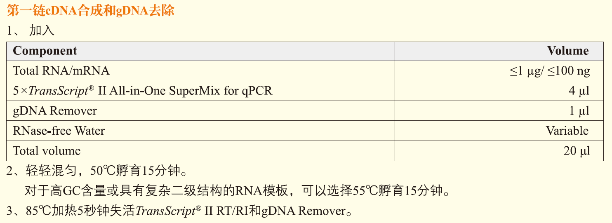

#   欢迎使用"反转录计算器"
开发这个小软件的原因很简单，要做大量的qPCR，每次提完RNA反转的时候都要重新计算一遍，好麻烦啊，直接写个R Shiny好了。

# 输入文件

输入文件为`.csv`文件，第一列是"Sample"，**第二列必须是“RNA浓度”**。后面的列可有可无。

# 单位

输入文件RNA浓度单位默认是`ng/μl`；输出文件的默认体积单位是`μl`。

# 参考文献

本软件是基于北京全式金的[试剂盒](https://www.transgen.com.cn/rt_pcr/933.html)进行计算的，反转录步骤如下：

